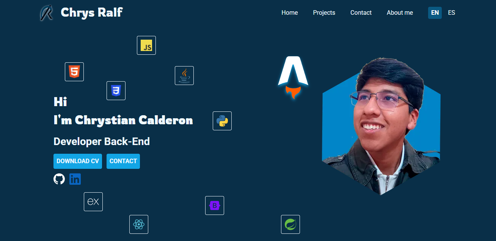

# Chrystian Calderon Portfolio

Welcome to my personal portfolio! Here you can explore my featured projects, the technologies and languages I use, contact me directly, and learn more about me.



## 🌐 Live Demo

You can view the portfolio online at: [Portfolio Live Link](https://www.chrysralf.dev/)

## 🚀 About the Project

This project was built using [Astro](https://astro.build/), a modern static site builder. The site is fully bilingual, allowing you to switch between English and Spanish with a simple click. You can also download my CV directly from the site.

### Main Features

- Project showcase with details and technologies used
- Tech stack carousel
- Contact form
- About me section
- Language switcher (English/Spanish)
- Download CV option

## 🛠️ Technologies Used

- Astro
- Tailwind CSS
- JavaScript

## 📦 Getting Started

To run locally:

```sh
npm install
npm run dev
```

## � License

This project is open source and free to use.
